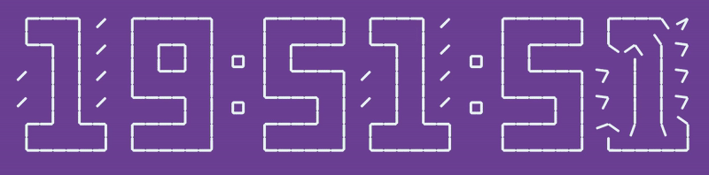

# Small Projects
These are all projects that are too small to deserve their own repository, so I have them here. Please excuse the short information about each one.
## Clock made from clocks
  
This is a clock I made out of clocks.

This projet is the first thing I've made with JavaScript & is hosted in the `clock.html` file. I have also commented out (in the file) some code that will add 2 text boxes on the website that allow you to dynamically change the color of the background & clock using hex codes (`#abcdef`).
