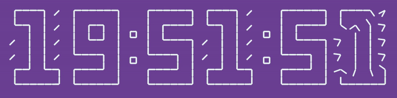

# Small Projects
These are all projects that are too small to deserve their own repository, so I have them here. Please excuse the short information about each one.
## Clock made from clocks
  
This is a clock I made out of clocks.

This projet is the first thing I've made with JavaScript & is hosted in the `clock.html` file. I have also commented out (in the file) some code that will add 2 text boxes on the website that allow you to dynamically change the color of the background & clock using hex codes (`#abcdef`).

## Binary Sorter Visualisation
  
This program is a sorting algorithm visualizer built with SFML. It generates a set of random bars and visually demonstrates how different sorting algorithms (Bubble Sort and Quick Sort) organize the data. The application highlights comparisons and swaps in real time while tracking the number of operations performed.
### Controls:
* `Space` – Start the selected sorting algorithm.
* `N` – Switch between Bubble Sort and Quick Sort.
* `R` – Generate a new random dataset and reset the visualization.

Once sorting is complete, a **"Done!"** message is displayed on the screen.

### Project Files:
All source files, assets, and project-related files are located within the `Sorter` folder.
